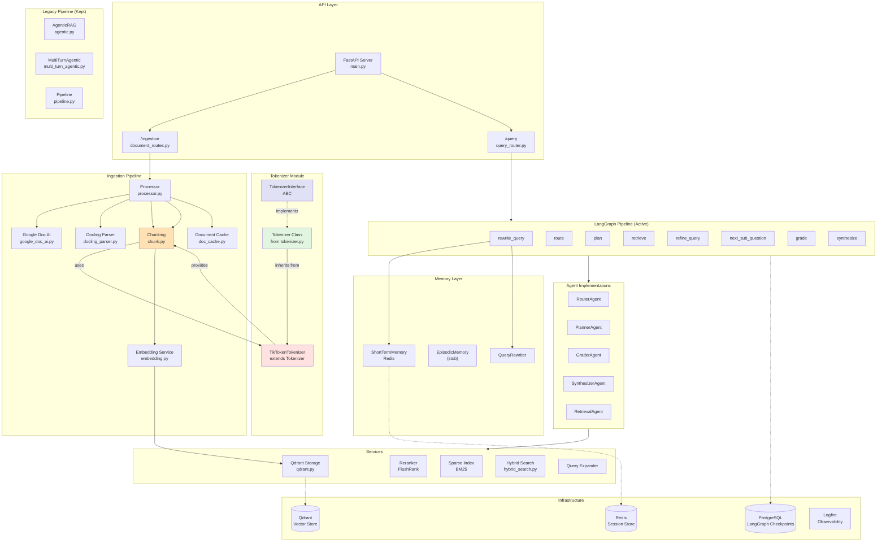
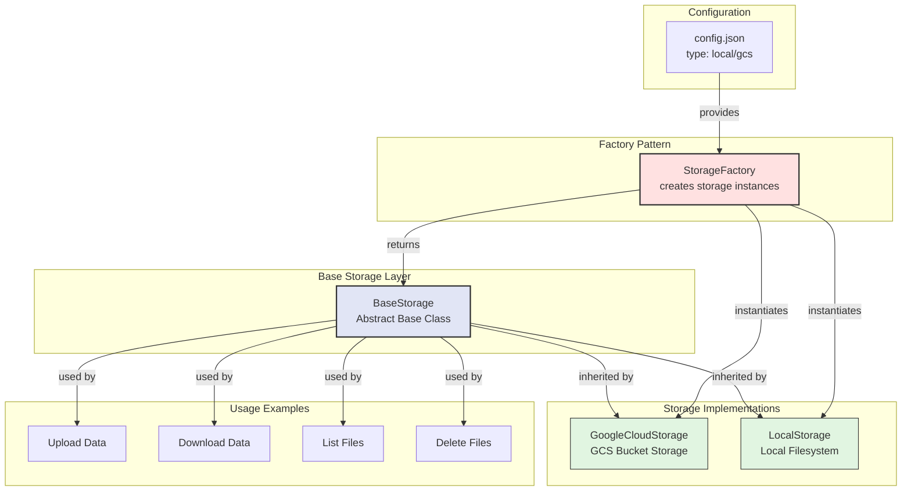
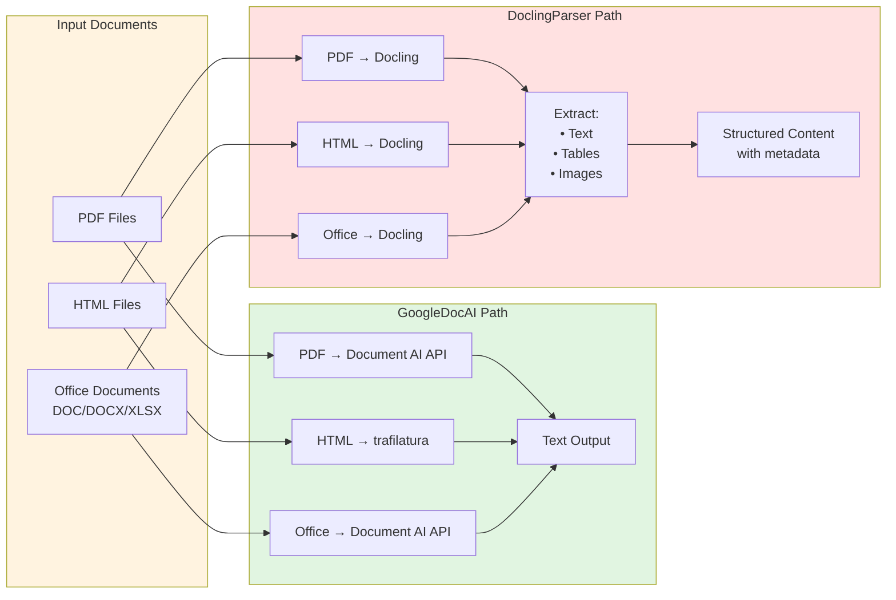
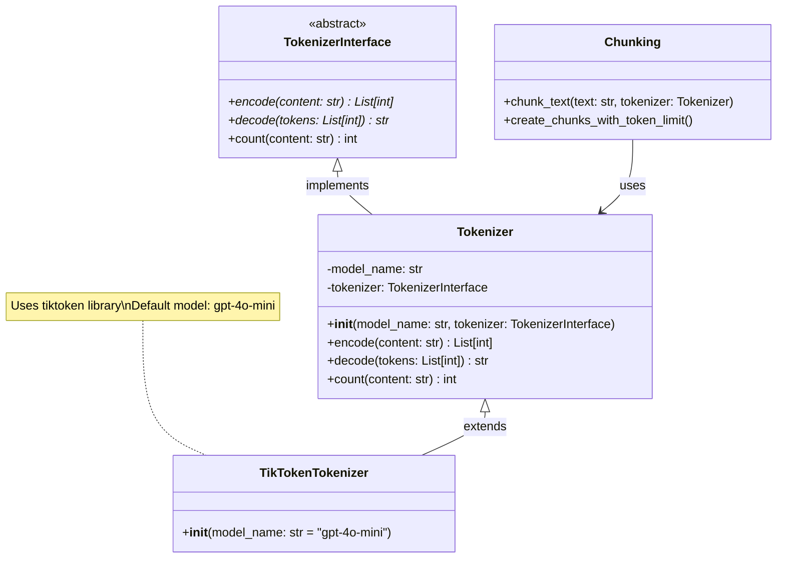

## Current Architecture Map

```mermaid
graph TB
    subgraph API["API Layer"]
        FA[FastAPI Server<br>main.py]
        DR["/ingestion<br>document_routes.py"]
        QR["/query<br>query_router.py"]
    end

    subgraph Tokenizer["Tokenizer Module"]
        direction TB
        TKR[Tokenizer Class<br/>from tokenizer.py]
        TKI[TokenizerInterface<br/>ABC]
        TTT[TikTokenTokenizer<br/>extends Tokenizer]

        TKI -.->|implements| TKR
        TKR -->|inherits from| TTT
    end

    subgraph Ingestion["Ingestion Pipeline"]
        PR[Processor<br>processor.py]
        DAI[Google Doc AI<br>google_doc_ai.py]
        DL[Docling Parser<br>docling_parser.py]
        CH[Chunking<br>chunk.py]
        EM[Embedding Service<br>embedding.py]
        DC[Document Cache<br>doc_cache.py]
    end


    subgraph Graph["LangGraph Pipeline (Active)"]
        RW[rewrite_query]
        RO[route]
        PL[plan]
        RT[retrieve]
        RQ[refine_query]
        NS[next_sub_question]
        GR[grade]
        SY[synthesize]
    end

    subgraph Legacy["Legacy Pipeline (Kept)"]
        AR[AgenticRAG<br>agentic.py]
        MT[MultiTurnAgentic<br>multi_turn_agentic.py]
        PP[Pipeline<br>pipeline.py]
    end

    subgraph Agents["Agent Implementations"]
        RA[RouterAgent]
        PA[PlannerAgent]
        GA[GraderAgent]
        SA[SynthesizerAgent]
        REA[RetrievalAgent]
    end

    subgraph Services["Services"]
        QD[Qdrant Storage<br>qdrant.py]
        RR[Reranker<br>FlashRank]
        SI[Sparse Index<br>BM25]
        HS[Hybrid Search<br>hybrid_search.py]
        QE[Query Expander]
    end

    subgraph Memory["Memory Layer"]
        STM[ShortTermMemory<br>Redis]
        EPM["EpisodicMemory<br>(stub)"]
        QRW[QueryRewriter]
    end

    subgraph Infra["Infrastructure"]
        PG[(PostgreSQL<br>LangGraph Checkpoints)]
        RD[(Redis<br>Session Store)]
        QDB[(Qdrant<br>Vector Store)]
        LF[Logfire<br>Observability]
    end

    FA --> DR & QR
    QR --> Graph
    DR --> PR
    PR --> DAI & DL
    PR --> CH -->|uses| TTT
    TTT -->|provides| CH
    PR --> CH
    CH --> EM --> QD
    PR --> DC
    Graph --> Agents
    Agents --> Services
    RW --> STM & QRW
    Graph -.-> PG
    STM -.-> RD
    QD -.-> QDB

    style TKR fill:#e1f5e1
    style TTT fill:#ffe1e1
    style TKI fill:#e1e1f5
    style CH fill:#ffe1b3
```

### Storage Chart

```mermaid
flowchart TB
    subgraph Base["Base Storage Layer"]
        BS[BaseStorage<br/>Abstract Base Class]
    end

    subgraph Implementations["Storage Implementations"]
        direction LR
        GCS[GoogleCloudStorage<br/>GCS Bucket Storage]
        LS[LocalStorage<br/>Local Filesystem]
    end

    subgraph Factory["Factory Pattern"]
        SF[StorageFactory<br/>creates storage instances]
    end

    subgraph Config["Configuration"]
        CONF[config.json<br/>type: local/gcs]
    end

    subgraph Usage["Usage Examples"]
        UP[Upload Data]
        DOWN[Download Data]
        LIST[List Files]
        DEL[Delete Files]
    end

    BS -->|inherited by| GCS
    BS -->|inherited by| LS

    CONF -->|provides| SF
    SF -->|instantiates| GCS
    SF -->|instantiates| LS
    SF -->|returns| BS

    BS -->|used by| UP
    BS -->|used by| DOWN
    BS -->|used by| LIST
    BS -->|used by| DEL

    style BS fill:#e1e5f5,stroke:#333,stroke-width:2px
    style GCS fill:#e1f5e1,stroke:#333,stroke-width:1px
    style LS fill:#e1f5e1,stroke:#333,stroke-width:1px
    style SF fill:#ffe1e1,stroke:#333,stroke-width:2px
```

### Parser Flow

```mermaid
flowchart LR
    subgraph Input["Input Documents"]
        PDF[PDF Files]
        HTML[HTML Files]
        OFF[Office Documents<br/>DOC/DOCX/XLSX]
    end

    subgraph GooglePath["GoogleDocAI Path"]
        GPDFP[PDF → Document AI API]
        GHP[HTML → trafilatura]
        GOP[Office → Document AI API]
        GOUT[Text Output]
    end

    subgraph DoclingPath["DoclingParser Path"]
        DPDFP[PDF → Docling]
        DHP[HTML → Docling]
        DOP[Office → Docling]
        DEX[Extract:<br/>• Text<br/>• Tables<br/>• Images]
        DOUT[Structured Content<br/>with metadata]
    end

    PDF --> GPDFP
    PDF --> DPDFP

    HTML --> GHP
    HTML --> DHP

    OFF --> GOP
    OFF --> DOP

    GPDFP --> GOUT
    GHP --> GOUT
    GOP --> GOUT

    DPDFP --> DEX
    DHP --> DEX
    DOP --> DEX
    DEX --> DOUT

    style Input fill:#fff3e0
    style GooglePath fill:#e1f5e1
    style DoclingPath fill:#ffe1e1
```

### Tokenizer Class Diagram

```mermaid
classDiagram
    %% Abstract base class
    class TokenizerInterface {
        <<abstract>>
        +encode(content: str) List[int]*
        +decode(tokens: List[int]) str*
        +count(content: str) int
    }

    %% Tokenizer classes
    class Tokenizer {
        -model_name: str
        -tokenizer: TokenizerInterface
        +__init__(model_name: str, tokenizer: TokenizerInterface)
        +encode(content: str) List[int]
        +decode(tokens: List[int]) str
        +count(content: str) int
    }

    class TikTokenTokenizer {
        +__init__(model_name: str = "gpt-4o-mini")
    }

    %% Chunking integration
    class Chunking {
        +chunk_text(text: str, tokenizer: Tokenizer)
        +create_chunks_with_token_limit()
    }

    %% Relationships
    TokenizerInterface <|-- Tokenizer : implements
    Tokenizer <|-- TikTokenTokenizer : extends
    Chunking --> Tokenizer : uses

    %% Usage note
    note for TikTokenTokenizer "Uses tiktoken library\nDefault model: gpt-4o-mini"
```
