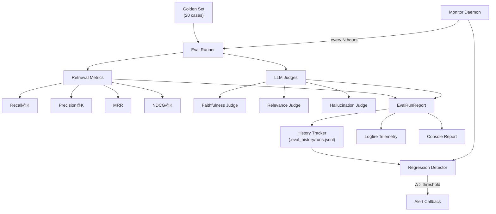

# Evaluation Infrastructure

> [!IMPORTANT]
> This is a production-grade evaluation harness for continuously tracking RAG retrieval quality and end-to-end answer correctness. It detects the silent quality degradation that happens as your corpus grows or shifts.

## Architecture



## Files Created

| File | Purpose |
|------|---------|
| [`medici/eval/__init__.py`](medici/eval/__init__.py) | Package init with public API exports |
| [`medici/eval/models.py`](medici/eval/models.py) | Pydantic models: `GoldenCase`, `CaseResult`, `EvalRunReport`, `AggregateMetrics` |
| [`medici/eval/metrics.py`](medici/eval/metrics.py) | Pure-function retrieval metrics: Recall@K, Precision@K, MRR, NDCG@K |
| [`medici/eval/judges.py`](medici/eval/judges.py) | Three LLM-as-judge evaluators: faithfulness, relevance, hallucination |
| [`medici/eval/runner.py`](medici/eval/runner.py) | Async evaluation runner with aggregate computation |
| [`medici/eval/history.py`](medici/eval/history.py) | JSONL history tracker with regression detection & trend analysis |
| [`medici/eval/monitor.py`](medici/eval/monitor.py) | Continuous monitoring daemon with alerting |
| [`medici/eval/__main__.py`](medici/eval/__main__.py) | CLI entry point (`python -m medici.eval`) |
| [`tests/unit/test_eval_metrics.py`](tests/unit/test_eval_metrics.py) | 24 unit tests for all retrieval metrics |
| [`tests/eval/golden_set.json`](tests/eval/golden_set.json) | Expanded v2.0 golden set (20 cases, 5 categories) |

## Metrics Tracked

### Retrieval Metrics (infrastructure-free, pure functions)

| Metric | What it measures | Why it matters |
|--------|-----------------|----------------|
| **Recall@K** | Fraction of expected items found in top-K | Are we *finding* the right chunks? |
| **Precision@K** | Fraction of top-K that are relevant | Are we drowning signal in noise? |
| **MRR** | 1/rank of first relevant result | How quickly do we surface the answer? |
| **NDCG@K** | Position-aware relevance scoring | Is our *ranking* good, not just retrieval? |

### Answer Quality (LLM-as-judge, composable)

| Judge | What it measures | Score range |
|-------|-----------------|-------------|
| **Faithfulness** | Is the answer grounded in retrieved context? | 0-1 (higher = better) |
| **Relevance** | Does the answer address the actual question? | 0-1 (higher = better) |
| **Hallucination** | Does the answer fabricate unsupported claims? | 0-1 (**lower** = better) |

## Usage

### One-shot evaluation
```bash
# Full evaluation (all judges)
python -m medici.eval

# Fast: retrieval metrics only (no LLM cost)
python -m medici.eval --skip-faithfulness --skip-relevance --skip-hallucination

# Custom K value
python -m medici.eval --retrieval-k 10
```

### CI gating
```bash
# Exit non-zero if thresholds not met
python -m medici.eval --exit-code \
    --threshold-recall 0.70 \
    --threshold-faithfulness 0.80
```

### Continuous monitoring
```bash
# Run every 6 hours, detect regressions automatically
python -m medici.eval --monitor --interval-hours 6

# Run 3 times then stop
python -m medici.eval --monitor --interval-hours 1 --max-runs 3
```

### Trend analysis
```bash
# Show last 10 runs
python -m medici.eval --show-trends --window 10
```

### Programmatic usage
```python
from medici.eval.runner import run_evaluation
from medici.eval.models import GoldenSet
from medici.eval.history import EvalHistory
from medici.eval.monitor import EvalMonitor

# One-shot
report = await run_evaluation(pipeline, judge_llm, golden_set)
print(f"Recall: {report.aggregate.avg_recall_at_k}")
print(f"MRR: {report.aggregate.avg_mrr}")
print(f"Hallucination: {report.aggregate.avg_hallucination}")

# Regression detection
history = EvalHistory()
regressions = history.detect_regressions(report)
for r in regressions:
    print(f"⚠️ {r['metric']}: {r['previous']} → {r['current']}")
history.append(report)


# Continuous monitoring with custom alerts
async def slack_alert(alert):
    await post_to_slack(alert.format_message())


monitor = EvalMonitor(pipeline, judge_llm, golden_set, alert_callback=slack_alert)
await monitor.run_loop(interval_hours=6)
```

## Regression Detection

The history tracker automatically detects quality degradation:

| Metric | Default Threshold | Severity |
|--------|------------------|----------|
| Recall drop | > 0.05 | warning / critical (> 0.10) |
| MRR drop | > 0.05 | warning / critical |
| Faithfulness drop | > 0.05 | warning / critical |
| Hallucination increase | > 0.10 | warning / critical (> 0.20) |

## Test Results

```
24 passed in 0.22s
```

All retrieval metrics are covered by unit tests (no infrastructure required):
- Perfect, partial, and zero recall scenarios
- K-limiting behavior
- ID and text-substring matching
- Case-insensitivity
- Edge cases (empty chunks, no expectations)

## Design Decisions

> [!NOTE]
> **Why a separate `medici.eval` package instead of extending `tests/eval/`?**
> The eval infrastructure is a first-class production concern, not just tests. The `medici.eval` package can be imported programmatically by the API, CI pipelines, or monitoring daemons. The existing `tests/eval/eval_runner.py` had all logic in one file and couldn't be imported cleanly (it had `import tests.eval` issues as seen in the eval_results.json).

> [!TIP]
> **Start cheap, add judges incrementally.** For daily CI runs, use `--skip-relevance --skip-hallucination` to only run retrieval metrics + faithfulness (1 LLM call per case). Save the full battery for nightly or weekly runs.
